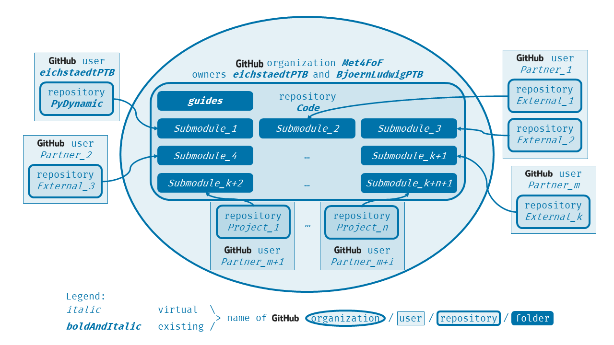

# Guide for software development in the EMPIR project 17IND12 ***Met4FoF***
This guide strives to help project partners, members of the stakeholder
advisory board and all others interested in the project outcomes and processes
to understand the way we are collaborating on code writing and software
development. We will constantly work on it and extend it as the project evolves,
questions arise and solutions are provided.    

## Support on coding
As all project partners agreed on making the code written for the project
publicly available, we have implemented state of the art tools on a publicly
available repository [*Met4FoF/Code*](https://github.com/Met4FoF/Code). These
tools are supporting or automating code review processes and identify certain
common issues with scientific open-source code. We will permanently evaluate
them while the project advances and enhance, extend or exchange them if needed
to ensure publication of high quality code only.  

## Contribution
There are several ways of contributing to the software development processes in
the project for all partners. The following picture sketches the architecture
for inlcuding [internal](#internal) and [external](#external) **Git**
repositories.

Basically there are two ways of contributing code.

1. Add an external **GitHub** repository to the [super-project](#super-project)

  This option lets you manage all your code in a **GitHub** repository owned by
  yourself completely seperated from the project. Whenever a revision of your
  code is ready to be published, you inform the [project's software development
  coordinator](https://github.com/BjoernLudwigPTB). After checking the code's
  compliance with the project's quality requirements your code will then be
  published as part of the super-project
  [*Met4FoF/Code*](https://github.com/Met4FoF/Code).

1. Use an internal **GitHub** repository in the [super-project](#super-project)

  This option lets you use a repository set up and maintained by the [project's
  software development coordinator](https://github.com/BjoernLudwigPTB). As
  collaborator you will be able to push your code directly into this repository.
  Whenever a revision of your code is ready to be published, you inform the
  [project's software development coordinator
  ](https://github.com/BjoernLudwigPTB). After checking the code's compliance
  with the project's quality requirements your code will then be published as
  part of the super-project [*Met4FoF/Code*](https://github.com/Met4FoF/Code).

## Glossary

This glossary's purpose is to create consensus about all software development
related terms in this guide.

* ### internal
Everything inside the scope of the **GitHub** organization [*Met4FoF*
](https://github.com/Met4FoF) is denoted as *internal*.

* ### external
Everything outside the scope of the **GitHub** organization [*Met4FoF*
](https://github.com/Met4FoF) is denoted as *external*.

* ### super-project
The **GitHub** repository [*Code*](https://github.com/Met4FoF/Code) of the
**GitHub** organization [*Met4FoF*](https://github.com/Met4FoF) is denoted as
*super-project*.
